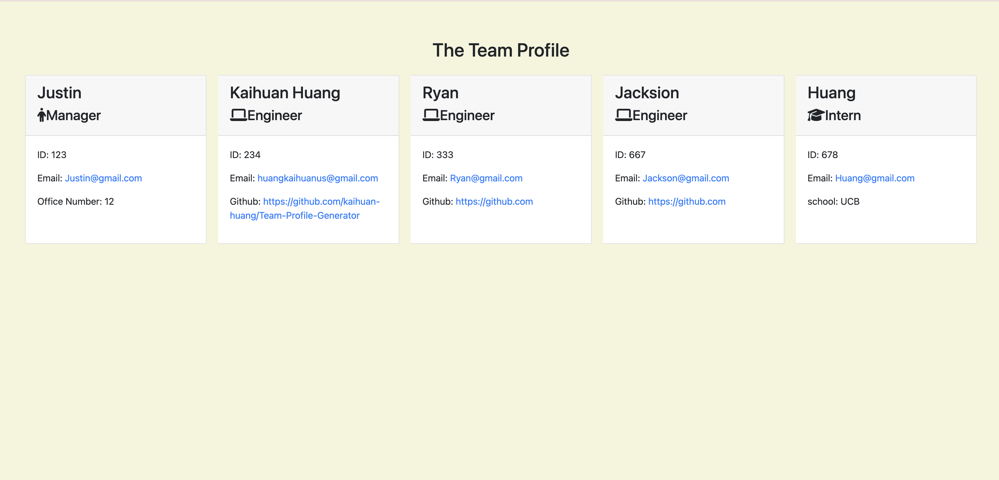

# Team Profile Generator 


## Description 
This application was created to generate a team profile based on user input using the Inquirer module from Node.js and displaying the information on a newly created html page with a style sheet. This project demonstrates use of OOP and TDD using Jest. 

GitHub: https://github.com/kaihuan-huang/Team-Profile-Generator

GitPage: https://kaihuan-huang.github.io/Team-Profile-Generator/
 
## Table of Contents
* [Installation](#installation)
* [Usage](#usage)
* [Screenshot](#Screenshot)
* [License](#license)
* [Contributing](#contributing)
* [Tests](#tests)
* [Questions](#questions)

## Installation 
The user should clone the repository from GitHub and download Node. This application also requires a file system and inquirer module. If testing is required, this application uses Jest. 

## Usage 
Use inquirer from your command line to answer questions about your project.
View walk through video here - [Screencastify](https://drive.google.com/file/d/1BKyXJX9jFh4Joi15KVfzaLZOtGJ3eVAN/view)<br>

## Screenshot

The following image demonstrate the web application's appearance:



## License 
This project is license under MIT

## Contributing 
Contributors should read the installation section. 

## Tests
Run `npm test` to run Jest for tests on constructors. 

## Questions
If you have any questions about this projects, please contact me directly at huangkaihuan0216@gmail.com. You can view more of my projects at https://github.com/kaihuan-huang.

## Made by
```
Kaihuan Huang

```